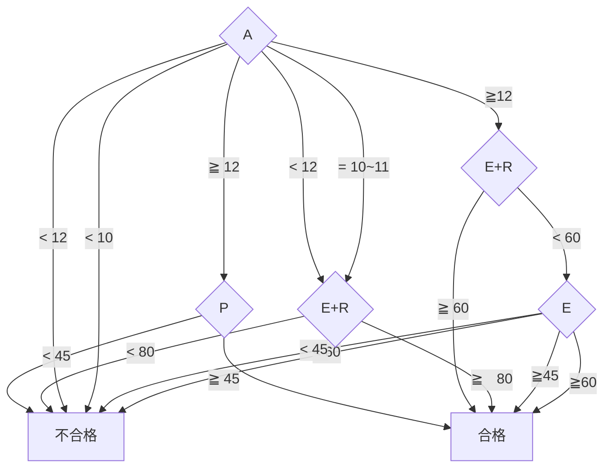

```mermaid
flowchart TD
attend{A}
goukei{E+R}
tarinai{E+R}
exam{E}
pass[合格]
fail[不合格]
point{P}

exam -->|≧60| pass
exam -->|< 60| fail
exam -->|≧45| pass
exam -->|< 45| fail

attend -->|< 10| fail
attend -->|= 10~11| tarinai
attend -->|< 12| fail
attend -->|≧12| goukei
attend -->|< 12| tarinai
attend -->|≧ 12| point

tarinai -->|< 80| fail
tarinai -->|≧　80| pass

goukei -->|≧ 60| pass
goukei -->|< 60| exam

point --> |≧ 45 | pass
point --> |< 45 | fail


```
