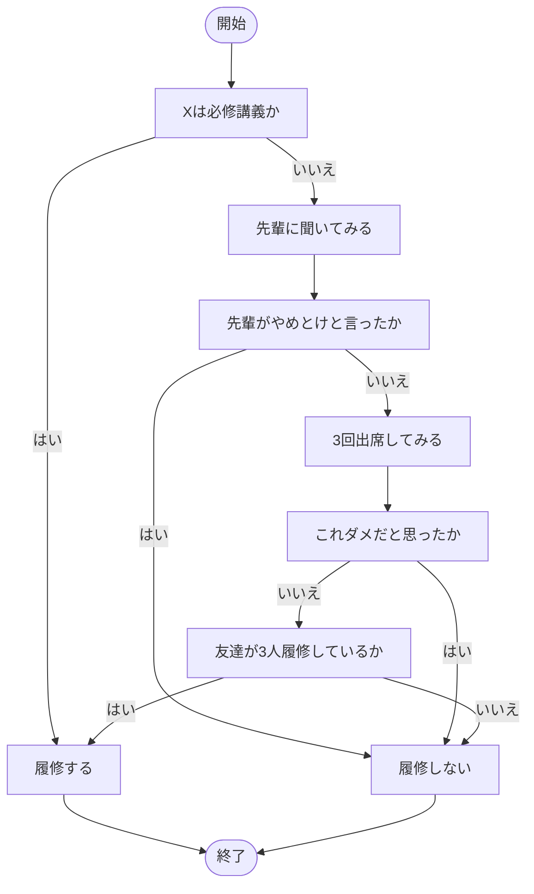

```mermaid
graph TD
    Start(["開始"])
    A["Xは必修講義か"]
    B["履修する"]
    C["先輩に聞いてみる"]
    D["先輩がやめとけと言ったか"]
    E["履修しない"]
    F["3回出席してみる"]
    G["これダメだと思ったか"]
    H["友達が3人履修しているか"]
    End(["終了"])

    Start --> A
    A -->|はい| B
    A -->|いいえ| C
    C --> D
    D -->|はい| E
    D -->|いいえ| F
    F --> G
    G -->|はい| E
    G -->|いいえ| H
    H -->|はい| B
    H -->|いいえ| E
    B --> End
    E --> End
```
